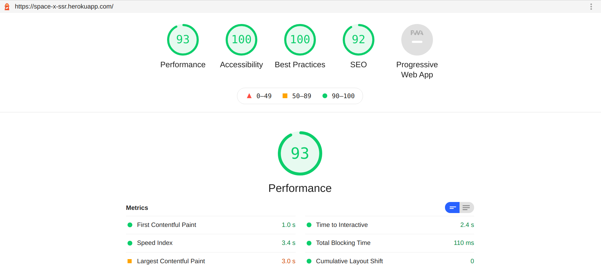

# Approach

Built a partial server side rendering react application, using create-react-app for making client build\
and a custom Express server implementation for serving server side html on first request.\

Stack: Node, Express and React.

## Setup

In the project directory, you can run:\

```
git clone
cd space_x
npm i
npm start
```

### Deployement

Application is deployed on Heroku server.\

Open [https://space-x-ssr.herokuapp.com/](https://space-x-ssr.herokuapp.com/) to view it in the browser.


### LightHouse



